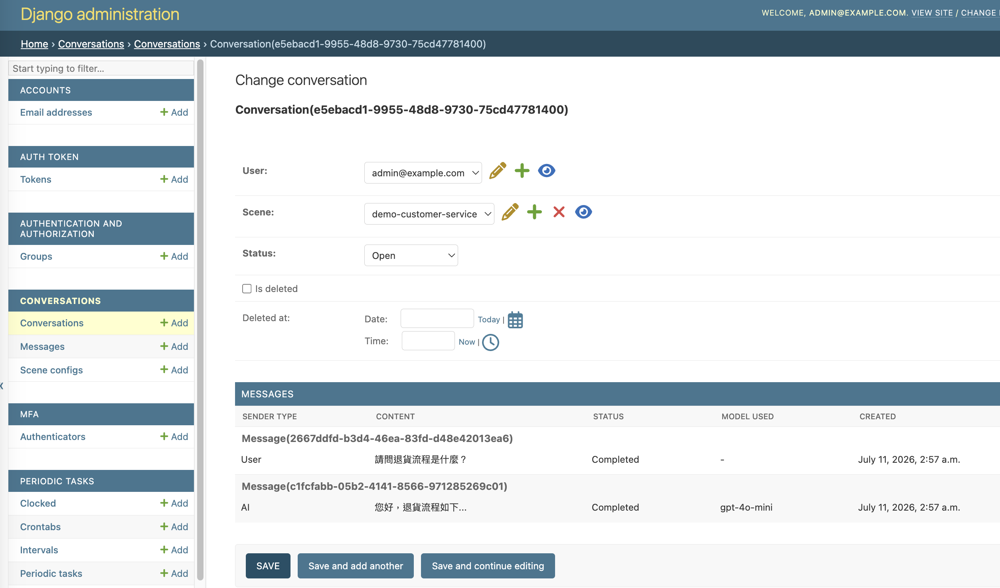

# MaiAgent AI Django

Behold My Awesome Project!

[](https://github.com/cookiecutter/cookiecutter-django/)
[](https://github.com/astral-sh/ruff)

## 測試流程

### 沒有本機 Postgres/Redis 時，用 Docker Compose 跑測試

```bash
# 1. 啟動測試依賴的服務（背景執行）
docker compose -f docker-compose.local.yml up -d postgres redis

# 2. 套用 migrations（首次或有新 migration 時）
docker compose -f docker-compose.local.yml run --rm django python manage.py migrate

# 3. 在 django 容器內執行 pytest
docker compose -f docker-compose.local.yml run --rm django uv run pytest
```

測試完成後：

- **保留資源**（建議，方便之後繼續測試/開發）：不用做任何事，容器會留在背景執行；下次直接重跑第 3 步即可。
- **關閉但保留資料**：`docker compose -f docker-compose.local.yml stop`（之後用 `start` 或 `up -d` 復原）。
- **完全清除**（含資料庫資料）：`docker compose -f docker-compose.local.yml down -v`。

## 查看 Admin 頁面（Conversations / Messages / Scene configs）

### 前置準備

- Docker 已安裝並可執行 `docker compose`。
- 專案根目錄下的 `.envs/.local/.django`、`.envs/.local/.postgres` 已存在（cookiecutter-django 產生專案時建立）。

### 步驟

```bash
# 1. 啟動完整服務（postgres/redis/mailpit/django），背景執行
docker compose -f docker-compose.local.yml up -d

# 2. 確認 migrations 已套用（首次啟動或有新 migration 時，容器啟動時的 /entrypoint 會自動跑一次，
#    也可手動再跑一次確認）
docker compose -f docker-compose.local.yml run --rm django python manage.py migrate

# 3. 建立一組可登入 Admin 的 superuser（若尚未建立過）
docker compose -f docker-compose.local.yml run --rm django python manage.py createsuperuser
```

> 若要用 `docker compose exec` 而非 `run` 進容器操作（例如額外用 shell 查資料），
> 要注意 `exec` 不會經過 `/entrypoint` 腳本，`DATABASE_URL` 不會自動組出來，
> 需要另外手動帶入，例如：
> `docker compose -f docker-compose.local.yml exec -e DATABASE_URL="postgres://<POSTGRES_USER>:<POSTGRES_PASSWORD>@postgres:5432/<POSTGRES_DB>" django python manage.py shell`
> （帳密可從 `.envs/.local/.postgres` 取得）。

### 進入 Admin 查看資料

1. 瀏覽器開啟 <http://localhost:8000/admin/>，用上一步建立的帳密登入。
2. 左側選單 **CONVERSATIONS** 分類下可看到三個資料表：
   - **Scene configs**：場景設定，編輯頁內有 `ModelRoute`（多模型路由）inline 表格，可直接調整 `model_name`/`order`/`weight`/`is_enabled`。
   - **Conversations**：list 頁可依 `scene`/`status` 篩選；點進單筆對話，可看到底下訊息的唯讀 inline 列表。
   - **Messages**：`content`/`model_used`/`error_message`/`metadata` 皆為唯讀欄位（訊息不可變），可用關鍵字搜尋 `content`。
3. 若資料庫是空的（尚未透過 API 建立過任何對話），Admin 頁面會是空清單；可先用 `python manage.py shell` 手動建立 `SceneConfig`/`Conversation`/`Message` 測試資料，或透過 API 提交查詢來產生資料。

**實際畫面（證據圖）**：`Conversation` 編輯頁，可看到 `scene`/`status` 欄位，以及底下 `Messages` 唯讀 inline（`content`/`status`/`model_used` 皆不可編輯）：



## Settings

Moved to [settings](https://cookiecutter-django.readthedocs.io/en/latest/1-getting-started/settings.html).

## Basic Commands

### Setting Up Your Users

- To create a **normal user account**, just go to Sign Up and fill out the form. Once you submit it, you'll see a "Verify Your E-mail Address" page. Go to your console to see a simulated email verification message. Copy the link into your browser. Now the user's email should be verified and ready to go.

- To create a **superuser account**, use this command:

      uv run python manage.py createsuperuser

For convenience, you can keep your normal user logged in on Chrome and your superuser logged in on Firefox (or similar), so that you can see how the site behaves for both kinds of users.

### Type checks

Running type checks with mypy:

    uv run mypy maiagent_ai_django

### Test coverage

To run the tests, check your test coverage, and generate an HTML coverage report:

    uv run coverage run -m pytest
    uv run coverage html
    uv run open htmlcov/index.html

#### Running tests with pytest

    uv run pytest

### Live reloading and Sass CSS compilation

Moved to [Live reloading and SASS compilation](https://cookiecutter-django.readthedocs.io/en/latest/2-local-development/developing-locally.html#using-webpack-or-gulp).

### Celery

This app comes with Celery.

To run a celery worker:

```bash
cd maiagent_ai_django
uv run celery -A config.celery_app worker -l info
```

Please note: For Celery's import magic to work, it is important _where_ the celery commands are run. If you are in the same folder with _manage.py_, you should be right.

To run [periodic tasks](https://docs.celeryq.dev/en/stable/userguide/periodic-tasks.html), you'll need to start the celery beat scheduler service. You can start it as a standalone process:

```bash
cd maiagent_ai_django
uv run celery -A config.celery_app beat
```

or you can embed the beat service inside a worker with the `-B` option (not recommended for production use):

```bash
cd maiagent_ai_django
uv run celery -A config.celery_app worker -B -l info
```

### Email Server

In development, it is often nice to be able to see emails that are being sent from your application. If you choose to use [Mailpit](https://github.com/axllent/mailpit) when generating the project a local SMTP server with a web interface will be available.

1.  [Download the latest Mailpit release](https://github.com/axllent/mailpit/releases) for your OS.

2.  Copy the binary file to the project root.

3.  Make it executable:

        chmod +x mailpit

4.  Spin up another terminal window and start it there:

        ./mailpit

5.  Check out <http://127.0.0.1:8025/> to see how it goes.

Now you have your own mail server running locally, ready to receive whatever you send it.

## Deployment

The following details how to deploy this application.
