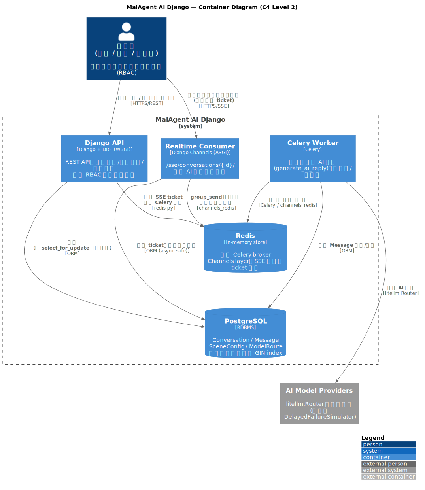
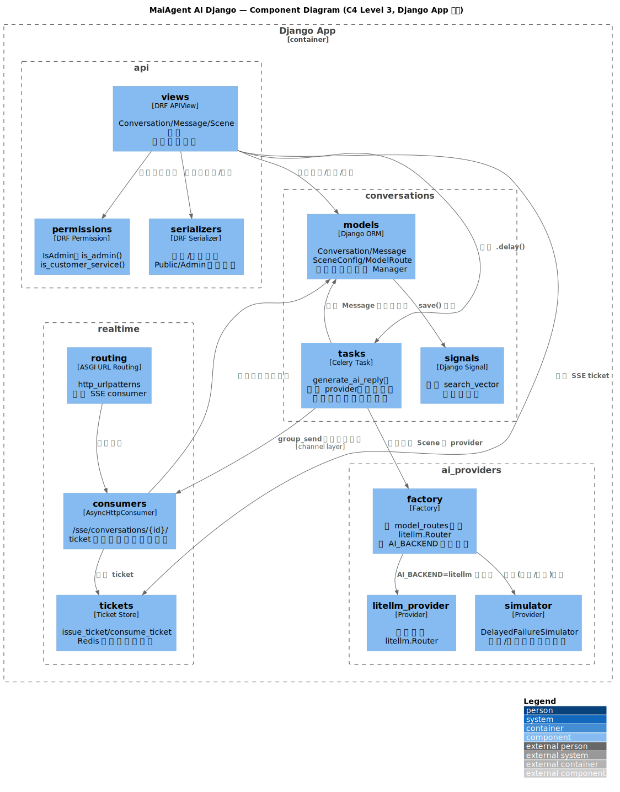

# MaiAgent AI Django

Behold My Awesome Project!

[](https://github.com/cookiecutter/cookiecutter-django/)
[](https://github.com/astral-sh/ruff)

[TOC]

## 開發過程與規格文件導覽

本專案的原始需求來自面試出題方提供的 [`prd.md`](./prd.md)（測驗說明、功能需求、評分重點、附加挑戰）。開發流程「先設計、後測試、再實作」：

1. **需求釐清與設計**（`/brainstorming`）：針對 `prd.md` 的四項功能需求，逐一討論架構、資料模型、決策取捨，產出四份逐項設計文件，並彙整成一份整合版設計文件。
2. **具體化為範例規格**（`/spec-by-example`）：把整合版設計的抽象規則轉成 Given-When-Then 範例情境——**這份是本專案實際遵循的頂級規格（specification）**，測試與實作都以它為準。
3. **TDD 紅燈 → 綠燈**：依範例規格先寫會失敗的 pytest 測試，再補最小實作讓測試通過。

### 頂級規格：Specification by Example

- [docs/superpowers/specs/2026-07-11-spec-by-example.md](./docs/superpowers/specs/2026-07-11-spec-by-example.md)：把設計拆成六大功能區塊（提交查詢/狀態控制、Celery 生成任務、Simulator、RBAC、全文檢索、SSE）的規則、範例、Given-When-Then 情境。**想理解「系統實際行為/測試在驗證什麼」，看這份就夠。**

### 子項目：逐輪設計文件（`docs/superpowers/specs/`）

以下文件是產出頂級規格前的討論過程紀錄，記錄「為什麼這樣設計、排除了哪些方案」，供追溯決策脈絡用，非開發時遵循的規格本身：

- [2026-07-08-conversation-management-design.md][spec-conversation]：對話管理（`Conversation`/`Message` 兩層資料模型、狀態機、軟刪除、全文檢索欄位）。
- [2026-07-09-ai-auto-reply-design.md][spec-ai-reply]：AI 自動回覆流程（Celery 任務、重試/轉人工、`ai_providers` 抽象介面）。
- [2026-07-09-api-admin-design.md][spec-api-admin]：API 與管理介面（RBAC、三支 REST API、SSE 即時推送、Django Admin 範圍）。
- [2026-07-10-scalability-model-routing-design.md][spec-scalability]：擴充性／多模型路由（`ModelRoute` 資料模型、`litellm.Router` 選模與容錯機制）。
- [2026-07-10-final-design.md][spec-final]：整合版設計文件，彙總以上四份並解決跨文件的衝突與修正（頂級規格即由此文件轉寫而成）。

若想了解某個決策為何如此（例如「為什麼選 `litellm.Router` 而非手刻演算法」），回頭查對應日期的文件即可；日常開發只需對照頂級規格。

[spec-conversation]: ./docs/superpowers/specs/2026-07-08-conversation-management-design.md
[spec-ai-reply]: ./docs/superpowers/specs/2026-07-09-ai-auto-reply-design.md
[spec-api-admin]: ./docs/superpowers/specs/2026-07-09-api-admin-design.md
[spec-scalability]: ./docs/superpowers/specs/2026-07-10-scalability-model-routing-design.md
[spec-final]: ./docs/superpowers/specs/2026-07-10-final-design.md

### 開發日誌：`handoff.md`

[`handoff.md`](./handoff.md) 是每一輪 AI 協作開發交接時寫下的過程紀錄，依時間序追加，每輪皆說明「做了什麼、為什麼這樣決策、邊界與假設、風險與尚未驗證的部分、下一步建議」。它記錄的是**開發過程本身**（討論脈絡、踩過的坑、待辦事項），不是規格——想知道系統該有什麼行為看上面的 spec，想知道某個實作細節或已知限制從何而來、下一步該做什麼，看 `handoff.md`。

## 系統架構圖（C4 Model）

以下用 [C4 Model](https://c4model.com/) 呈現系統架構，用 [C4-PlantUML](https://github.com/plantuml-stdlib/C4-PlantUML) 撰寫，原始碼在 [`docs/architecture/`](./docs/architecture/)（`.puml`），並附上已渲染好的 `.svg` 直接嵌入此頁。

- Level 1｜System Context
  - 原始碼：[context.puml](./docs/architecture/context.puml)
  - 圖片：[context.svg](./docs/architecture/context.svg)
- Level 2｜Container
  - 原始碼：[container.puml](./docs/architecture/container.puml)
  - 圖片：[container.svg](./docs/architecture/container.svg)
- Level 3｜Component（Django App 內部）
  - 原始碼：[component.puml](./docs/architecture/component.puml)
  - 圖片：[component.svg](./docs/architecture/component.svg)
- 補充圖｜Dynamic Diagram：提交訊息 → AI 回覆 → SSE 推播
  - 原始碼：[dynamic.puml](./docs/architecture/dynamic.puml)
  - 圖片：[dynamic.svg](./docs/architecture/dynamic.svg)

### Level 2｜Container



### Level 3｜Component（Django App 內部）



## 可優化項目（測驗時間有限，尚未完成的部分）

受限於一週的作答時間，以下項目已知需要進一步優化，但無法在本次測驗中完整處理。已依此模擬開兩張 Ticket，記錄「需要向同事請求支援」的具體內容：

- **[Issue #4：SSE 本機/正式環境 ASGI 串接與端到端驗證](https://github.com/KScaesar/MaiAgent2026/issues/4)**
  SSE 即時推送目前只在測試環境用 `ApplicationCommunicator` 驗證過，本機 `docker compose up` 起來的 dev server 仍是 WSGI（`runserver_plus`），尚未真正把 `/sse/...` 端點串起來給瀏覽器使用。需要同事協助決定正式環境 ASGI 部署策略、改造本機 compose 設定，並實機驗證一次完整 SSE 事件流。

- **[Issue #5：中文全文檢索方案選型（search_vector/GIN index 目前形同虛設）](https://github.com/KScaesar/MaiAgent2026/issues/5)**
  PostgreSQL 內建 `simple` text search config 無法處理中文分詞，`?q=` 全文檢索暫時改用 `icontains` 應急，`search_vector` 欄位與 GIN index 目前沒有被實際查詢用到。需要同事協助評估 `zhparser`/`pg_trgm` 等中文分詞方案在正式環境的可行性，以及資料量成長後的效能影響。

其餘已知但優先度較低、暫未另開 issue 的項目（詳見 `handoff.md` 各輪「待解決問題」段落）：

- `POST /api/conversations/`（建立新對話端點）與 `metadata` 欄位（token 用量等）的實際寫入邏輯尚未實作。
- `get_provider` 的 `AI_BACKEND` 環境變數切換邏輯、`LiteLLMProvider` 分支、Scene 無啟用 `ModelRoute` 時的 edge case，皆未被任何測試涵蓋。
- 併發鎖定（`select_for_update()`）目前僅以 `threading` 模擬驗證，未在真正多 process/多 worker 環境下壓測過。
- Repo 尚未設定 branch protection，要求 CI 通過才能合併/push 到 `main`，避免技術債再度累積。

## 測試流程

### 沒有本機 Postgres/Redis 時，用 Docker Compose 跑測試

```bash
# 1. 啟動測試依賴的服務（背景執行）
docker compose -f docker-compose.local.yml up -d postgres redis

# 2. 套用 migrations（首次或有新 migration 時）
docker compose -f docker-compose.local.yml run --rm django python manage.py migrate

# 3. 在 django 容器內執行 pytest
docker compose -f docker-compose.local.yml run --rm django uv run pytest
```

測試完成後：

- **保留資源**（建議，方便之後繼續測試/開發）：不用做任何事，容器會留在背景執行；下次直接重跑第 3 步即可。
- **關閉但保留資料**：`docker compose -f docker-compose.local.yml stop`（之後用 `start` 或 `up -d` 復原）。
- **完全清除**（含資料庫資料）：`docker compose -f docker-compose.local.yml down -v`。

## 查看 Admin 頁面（Conversations / Messages / Scene configs）

### 前置準備

- Docker 已安裝並可執行 `docker compose`。
- 專案根目錄下的 `.envs/.local/.django`、`.envs/.local/.postgres` 已存在（cookiecutter-django 產生專案時建立）。

### 步驟

```bash
# 1. 啟動完整服務（postgres/redis/mailpit/django），背景執行
docker compose -f docker-compose.local.yml up -d

# 2. 確認 migrations 已套用（首次啟動或有新 migration 時，容器啟動時的 /entrypoint 會自動跑一次，
#    也可手動再跑一次確認）
docker compose -f docker-compose.local.yml run --rm django python manage.py migrate

# 3. 建立一組可登入 Admin 的 superuser（若尚未建立過）
docker compose -f docker-compose.local.yml run --rm django python manage.py createsuperuser
```

> 若要用 `docker compose exec` 而非 `run` 進容器操作（例如額外用 shell 查資料），
> 要注意 `exec` 不會經過 `/entrypoint` 腳本，`DATABASE_URL` 不會自動組出來，
> 需要另外手動帶入，例如：
> `docker compose -f docker-compose.local.yml exec -e DATABASE_URL="postgres://<POSTGRES_USER>:<POSTGRES_PASSWORD>@postgres:5432/<POSTGRES_DB>" django python manage.py shell`
> （帳密可從 `.envs/.local/.postgres` 取得）。

### 進入 Admin 查看資料

1. 瀏覽器開啟 <http://localhost:8000/admin/>，用上一步建立的帳密登入。
2. 左側選單 **CONVERSATIONS** 分類下可看到三個資料表：
   - **Scene configs**：場景設定，編輯頁內有 `ModelRoute`（多模型路由）inline 表格，可直接調整 `model_name`/`order`/`weight`/`is_enabled`。
   - **Conversations**：list 頁可依 `scene`/`status` 篩選；點進單筆對話，可看到底下訊息的唯讀 inline 列表。
   - **Messages**：`content`/`model_used`/`error_message`/`metadata` 皆為唯讀欄位（訊息不可變），可用關鍵字搜尋 `content`。
3. 若資料庫是空的（尚未透過 API 建立過任何對話），Admin 頁面會是空清單；可先用 `python manage.py shell` 手動建立 `SceneConfig`/`Conversation`/`Message` 測試資料，或透過 API 提交查詢來產生資料。

**實際畫面（證據圖）**：`Conversation` 編輯頁，可看到 `scene`/`status` 欄位，以及底下 `Messages` 唯讀 inline（`content`/`status`/`model_used` 皆不可編輯）：


## Settings

Moved to [settings](https://cookiecutter-django.readthedocs.io/en/latest/1-getting-started/settings.html).

## Basic Commands

### Setting Up Your Users

- To create a **normal user account**, just go to Sign Up and fill out the form. Once you submit it, you'll see a "Verify Your E-mail Address" page. Go to your console to see a simulated email verification message. Copy the link into your browser. Now the user's email should be verified and ready to go.

- To create a **superuser account**, use this command:

      uv run python manage.py createsuperuser

For convenience, you can keep your normal user logged in on Chrome and your superuser logged in on Firefox (or similar), so that you can see how the site behaves for both kinds of users.

### Type checks

Running type checks with mypy:

    uv run mypy maiagent_ai_django

### Test coverage

To run the tests, check your test coverage, and generate an HTML coverage report:

    uv run coverage run -m pytest
    uv run coverage html
    uv run open htmlcov/index.html

#### Running tests with pytest

    uv run pytest

### Live reloading and Sass CSS compilation

Moved to [Live reloading and SASS compilation](https://cookiecutter-django.readthedocs.io/en/latest/2-local-development/developing-locally.html#using-webpack-or-gulp).

### Celery

This app comes with Celery.

To run a celery worker:

```bash
cd maiagent_ai_django
uv run celery -A config.celery_app worker -l info
```

Please note: For Celery's import magic to work, it is important _where_ the celery commands are run. If you are in the same folder with _manage.py_, you should be right.

To run [periodic tasks](https://docs.celeryq.dev/en/stable/userguide/periodic-tasks.html), you'll need to start the celery beat scheduler service. You can start it as a standalone process:

```bash
cd maiagent_ai_django
uv run celery -A config.celery_app beat
```

or you can embed the beat service inside a worker with the `-B` option (not recommended for production use):

```bash
cd maiagent_ai_django
uv run celery -A config.celery_app worker -B -l info
```

### Email Server

In development, it is often nice to be able to see emails that are being sent from your application. If you choose to use [Mailpit](https://github.com/axllent/mailpit) when generating the project a local SMTP server with a web interface will be available.

1.  [Download the latest Mailpit release](https://github.com/axllent/mailpit/releases) for your OS.

2.  Copy the binary file to the project root.

3.  Make it executable:

        chmod +x mailpit

4.  Spin up another terminal window and start it there:

        ./mailpit

5.  Check out <http://127.0.0.1:8025/> to see how it goes.

Now you have your own mail server running locally, ready to receive whatever you send it.

## Deployment

The following details how to deploy this application.
